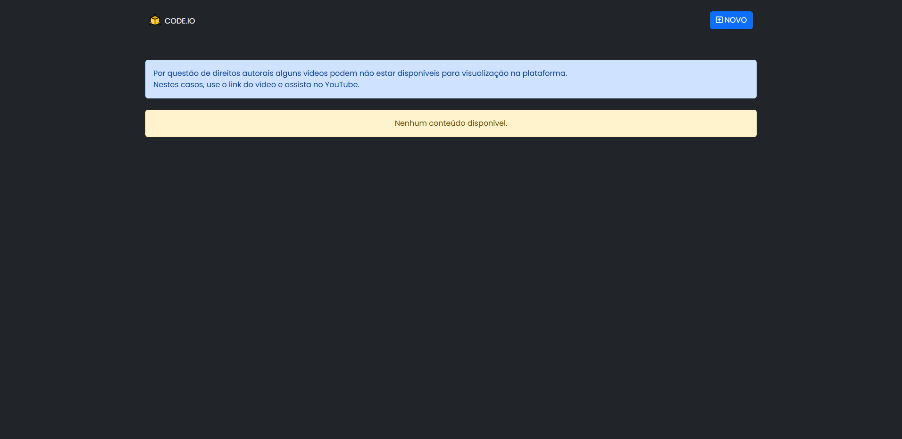

## Apresentação Geral

**Nome do Projeto:** code.io

**Descrição:**

Este é um aplicativo SPA criado para interagir com a minha API: [code.io.api](https://github.com/Edssaac/code.io.api). 
A plataforma permite aos usuários compartilhar vídeos relacionados à tecnologia, oferecendo funcionalidades para cadastro, 
edição, remoção e visualização de vídeos. Este projeto tem como principal objetivo proporcionar aprendizado e prática no 
desenvolvimento de aplicações web.

**Objetivo:**

Implementar uma SPA para integrar e consumir a minha API, visando oferecer uma experiência otimizada e responsiva aos usuários finais.

**Tecnologias Utilizadas:**

## Documentação da API

## Contato

